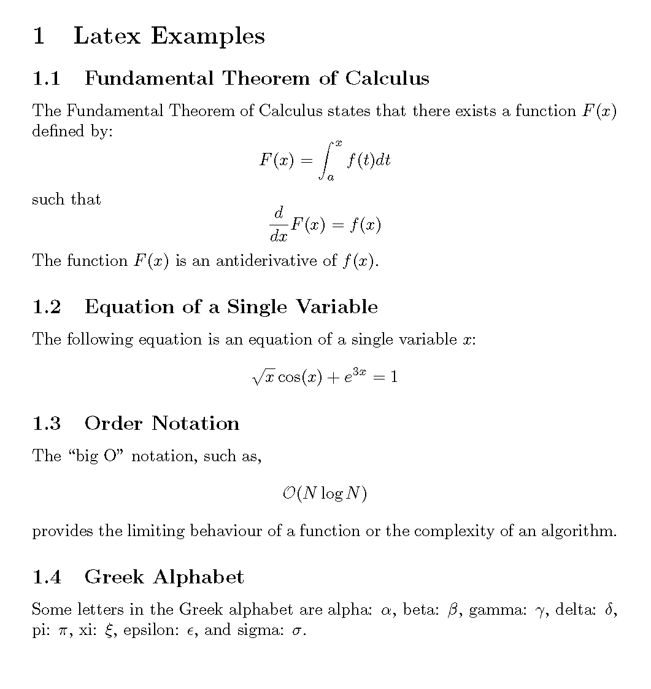

# CSCI / MATH 2072U - Computational Science 1

## Assignment 1
### Deadline:  11:59am on January 19, 2024
This assignment is aimed at introducing you to the GitHub Classroom workflow that will be used throughout the course. In addition, the assignment introduces you to the tools you’ll need to work with Python and Latex.

Instructions:  Answer the following questions.  Commit and push your changes to your repository before the assignment deadline.

__1. Python__\
In your repo, you'll find a template file named `HelloWorld.py`. Modify the function `HelloWorld()` so that it takes a `string name` as an input argument and returns the string `"Hello <input name>!"`.

For example: If the input is the string `John Doe`, the function should return `"Hello John Doe!"`

__2. LaTeX__\
Use a LaTeX editor to typeset the following:

Once you have reproduced the text and equations of the example, upload a PDF filed named  `LatexExamples.pdf` containing the reproduction to your assignment repository.
To help you, a starter Latex template called `LatexExamples.tex` is available in the repository.

Push the changes you make to `LatexExamples.tex` file. The file should reflect all the changes that are required to arrive at the final PDF with the equations that you have uploaded.

You can use any Latex editor of your preference such as [TeXmaker](https://www.xm1math.net/texmaker/), [TeXShop](https://pages.uoregon.edu/koch/texshop/), [Texstudio](http://texstudio.sourceforge.net/), etc. You can also use online Latex editors such as [Overleaf](https://www.overleaf.com/) or visual mathematical editors such as [Lyx](https://www.lyx.org/Home).

In case of any questions or doubts, ask the instructor or the teaching assistants for help through the slack channel `#assignment_1`.
